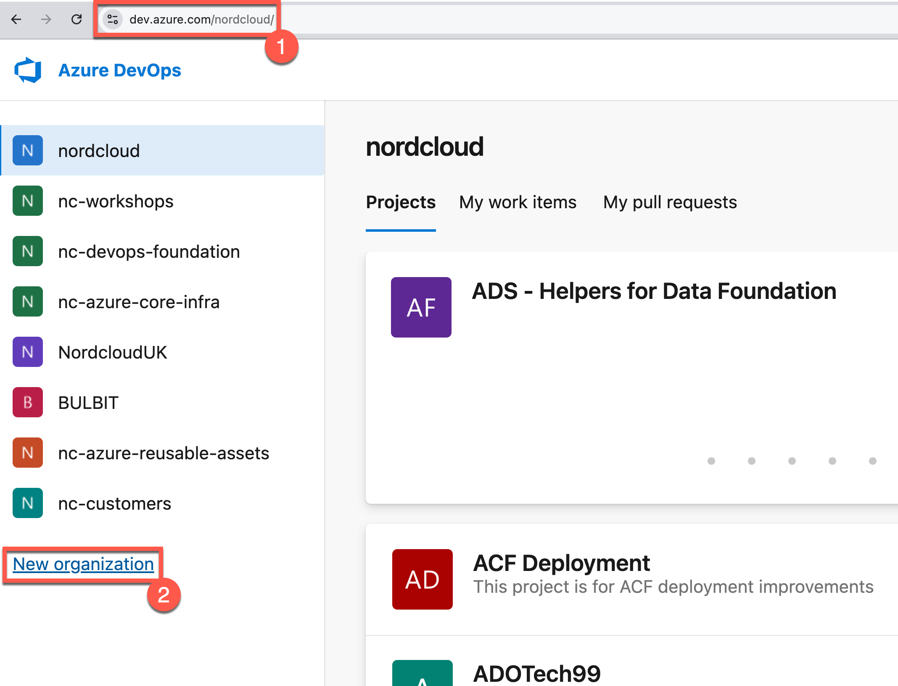
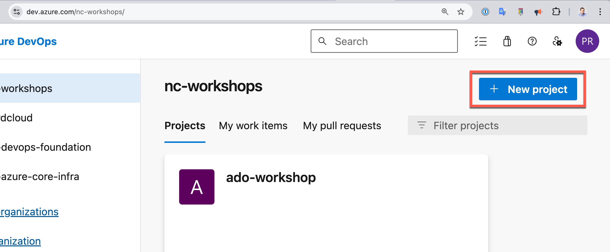
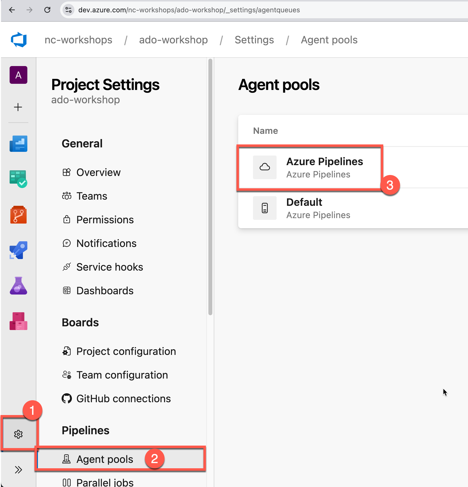
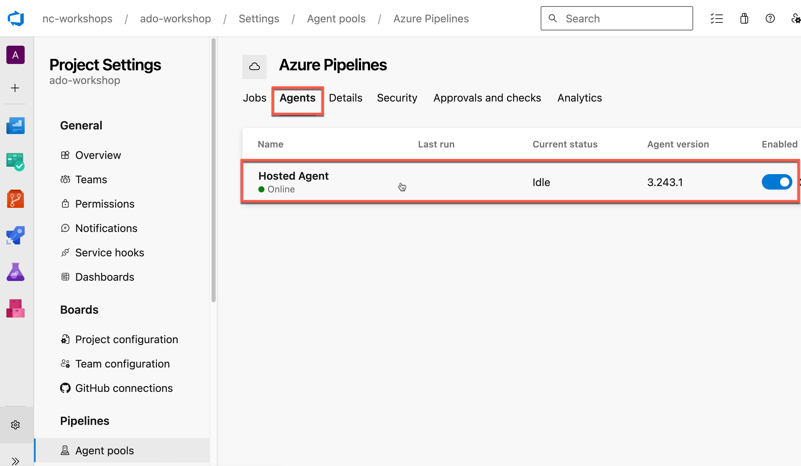
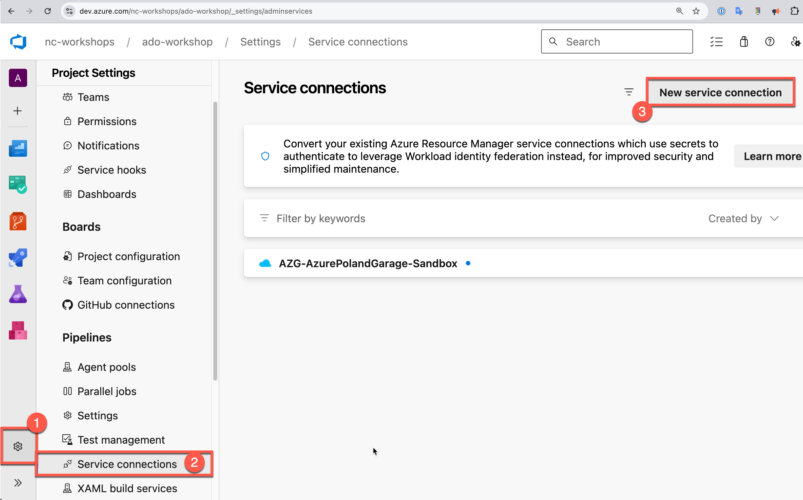
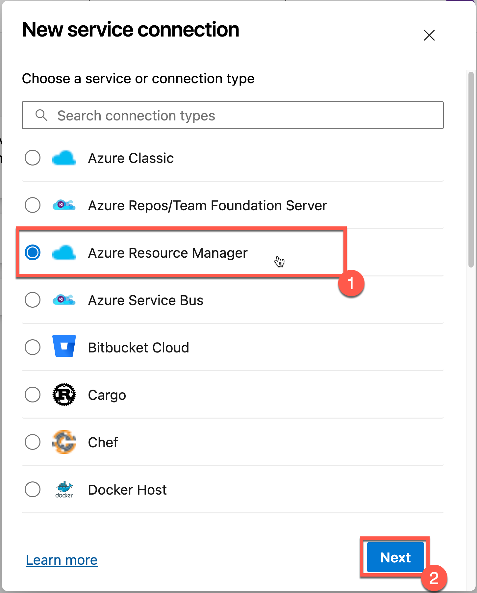
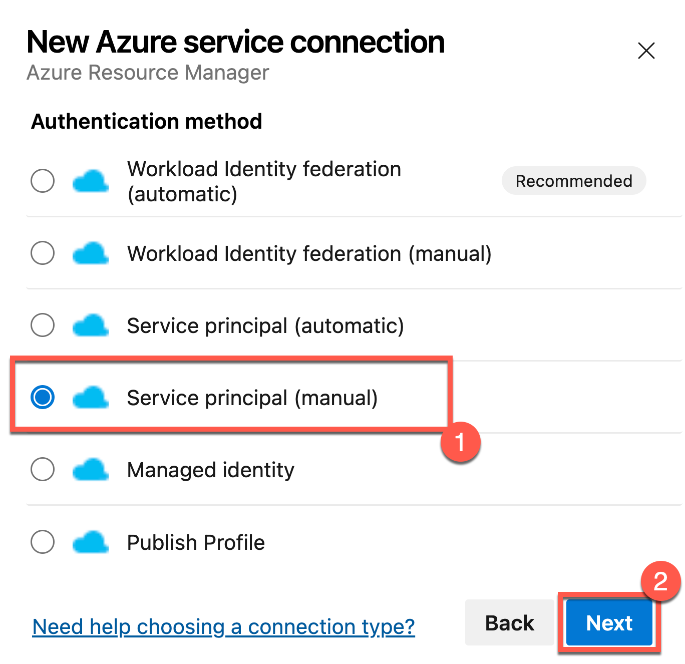
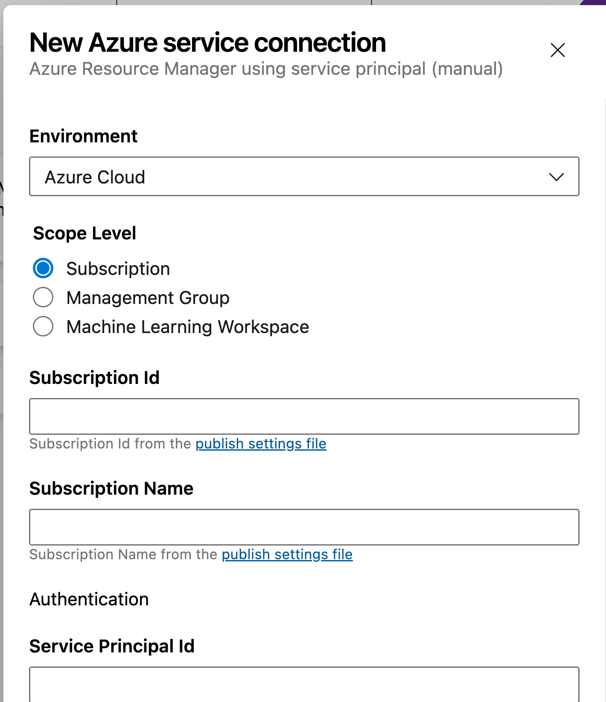

# wokrshop-ado-01
## prerequisites

### Azure DevOps - Creation organization and project

1. Create new organization in Azure DevOps using Company mail, use your random name for workshop.

2. In new created organization please create first project, use your random name for project.

3. After creation please check if you have deployment Agent in ADO. Click settings, agent pools, azure pipelines.

4. VERIFICATION: There should be pool with name: Hosted Agent. If you have'nt here agents, you should follow with informations on the page, there will be something like warning label with instruction. If you have agent all is fine you can go to next step.

### Service connection for deployments

1. In Azure you should create SPN like here: https://learn.microsoft.com/en-us/cli/azure/azure-cli-sp-tutorial-1?tabs=bash
   1. For next steps you need:
      1. Application Id
      2. Secret
      3. Subscription Id
      4. Tenant Id
2. After creation SPN please open ADO project, and click: settings, service connections, new service connection.

3. Select: Azure Resource Manager.

4. Select: Service principal (manual).

5. Fill in all information about SPN and Subscription.
   1. Subscription ID: Put your ID.
   2. Subscription Name: Put your sub name.
   3. Service Principal Id: Put here from point 1.1.
   4. Service principal key: Put here from point 1.1.
   5. Tenant ID: use tenant id depends on subscription it could be Nordcloud Garage Tenant Id or use yours where you have Azure Subscription.

6. Click: verify.
7. Click save if verification has been completed.